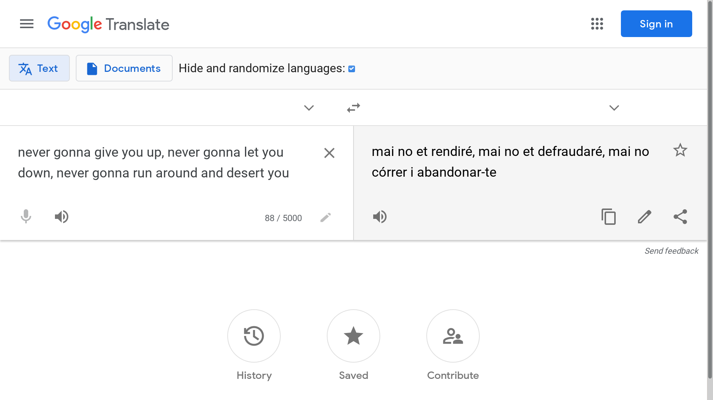

# Google Translate Game

This project turns Google Translate into a game: translate text into a random language and try to guess what the language is. It's fun to play with your friends, if you have friends who enjoy this kind of stuff. (I happen to.)

## Instructions

1. Open [Google Translate](https://translate.google.com)
2. Open the developer console, paste the code from [this file](google-translate-game.js), and run it
3. Check the checkbox in the top bar to hide the language names and randomize the menu
4. Open the dropdown menu on the top right, and select a random language to translate to
5. Try to guess what the language is
6. Uncheck the checkbox to see if you were right
7. To play again, go back to step 3

## License

This project is licensed under the [MIT License](LICENSE.md).
